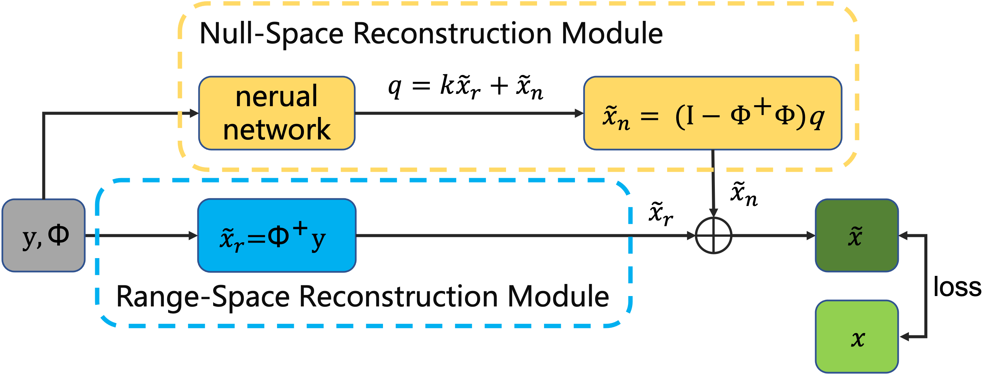

<div align="center">
<h1>RND-SCI</h1>
<h3>A Range-Null Space Decomposition Approach for Fast and Flexible Spectral Compressive Imaging</h3>

[Junyu Wang](https://github.com/Junyu99)<sup>1</sup> \*, [Shijie Wang](https://github.com/simonJJJ)<sup>1</sup> \*, Ruijie Zhang<sup>1</sup> Zengqiang Zheng<sup>2</sup>, [Wenyu Liu](http://eic.hust.edu.cn/professor/liuwenyu/)<sup>1</sup>, [Xinggang Wang](https://xinggangw.info/)<sup>1 :email:</sup>,
 
<sup>1</sup> [School of EIC, HUST](http://eic.hust.edu.cn/English/Home.htm), <sup>2</sup> [Wuhan Jingce Electronic Group](http://www.wuhanjingce.com/index.html).

(\*) equal contribution, (<sup>:email:</sup>) corresponding author.

Arxiv Preprint

</div>

<p align="center">

</p>

This repo can reproduce the main results in Tabel 1. and Tabel 2. of our paper. All the source code and pre-trained models will be released to the public for further research.

**We implement the core operators shift_3d and shift_3d_back in HSI reconstruction by cuda for faster speed. Hope it is helpful for the community.**

### Create Environment:

------
- Python 3 (Recommend to use [Anaconda](https://www.anaconda.com/download/#linux))

- [PyTorch >= 1.3](https://pytorch.org/)

- NVIDIA GPU + [CUDA](https://developer.nvidia.com/cuda-downloads)

- Python packages:

  ```shell
  pip install -r requirements.txt
  ```

- Build cuda operators
  ```shell
  python setup.py develop
  ```

### Prepare Dataset:

Download the dataset from https://github.com/mengziyi64/TSA-Net, put the dataset into the corresponding folder 'code/datasets/', and recollect them in the following form:

    |--datasets
        |--cave_1024_28
            |--scene1.mat
            |--scene2.mat
            ：  
            |--scene205.mat
        |--CAVE_512_28
            |--scene1.mat
            |--scene2.mat
            ：  
            |--scene30.mat
        |--KAIST_CVPR2021  
            |--1.mat
            |--2.mat
            ： 
            |--30.mat
        |--TSA_simu_data  
            |--mask.mat   
            |--Truth
                |--scene01.mat
                |--scene02.mat
                ： 
                |--scene10.mat
        |--TSA_real_data  
            |--mask.mat   
            |--Measurements
                |--scene1.mat
                |--scene2.mat
                ： 
                |--scene5.mat
### Training and Testing for simulation experiment:
#### Training 

##### Training from scratch
If you want to train any other model with `RND-SCI`, please refer to the following format:
```python
# RND_[model]
python simu_train.py --method rnd_[original model name] --outf ./exp/simu_rnd_[original model name] / --seed 42 --gpu_id 0
```

for example:
```python
# RND-SAUNet
python simu_train.py --method rnd_saunet_1stg --outf ./exp/simu_rnd_saunet_1stg/ --seed 42 --gpu_id 0 

# RND_MST
python simu_train.py --method rnd_mst --outf ./exp/simu_rnd_mst/ --seed 42 --gpu_id 0 
```

##### Fine-tuning with pre-trained model
If you have original pre-trained model without/ with RND-SCI framework and want to train with RND-SCI, please refer to the following format:
```python
python simu_train.py --method rnd_[original model name] --outf ./exp/simu_rnd_[original model name] / --pretrained_model_path  [your model with/without RND-SCI path] --seed 42 --gpu_id 0 
```
Please use checkpointing (--cp) when running out of memory. Refer to 'utils/simu_utils/simu_args.py' to use more options.

#### Testing 
a). Test our models on the HSI dataset. The results will be saved in 'code/test/' in the MatFile format. For example, we test the RND-SAUNet:
```python
python simu_test.py --method rnd_saunet_1stg --outf ./test/simu_rnd_saunet_1stg   --pretrained_model_path [your model with/without RND-SCI path]
```
b). Calculate quality assessment. We use the same quality assessment code as DGSMP. So please use Matlab, get in 'code/analysis_tools/Quality_Metrics/', and then run 'Cal_quality_assessment.m'.

c). If you want test the other models with RND-SCI , please change the model your want to test in above step a).

d). If you want to plug and play a model with RND, whether the pre-trained model uses RND-SCI or not, you can **directly use the command** that refers to a).

#### Training and Testing for real data experiment:
##### Training from scratch
If you want to train any other model with `RND-SCI`, please refer to the following format:
```python
# RND_[model]
python real_train.py --method rnd_[original model name] --outf ./exp/real_rnd_[original model name] / --seed 42 --gpu_id 0 --isTrain
```
for example:
```python
# RND-SAUNet
python real_train.py --method rnd_saunet_1stg --outf ./exp/real_rnd_saunet_1stg/ --seed 42 --gpu_id 0 --isTrain

# RND_MST
python real_train.py --method rnd_mst --outf ./exp/real_rnd_mst/ --seed 42 --gpu_id 0 --isTrain
```

##### Testing 
a). Test our models on the HSI dataset. The results will be saved in 'code/evaluation/testing_result/' in the MatFile format. For example, we test the RND-SAUNet:
```python
python real_test.py --method rnd_saunet_1stg --outf ./test/real_rnd_saunet_1stg  --pretrained_model_path [your model with/without RND-SCI path]
```
b). Calculate quality assessment. We use no reference image quality assessments (Naturalness Image Quality Evaluator, **NIQE** ). So please use Matlab, get in 'code/analysis_tools/Quality_Metrics/', and then run 'NIQE_metric.m'.

c). If you want test SAUNet-1stg or the others , please change the model your want to test in above step a).

d). If you want to plug and play a model with RND, whether the pre-trained model uses RND-SCI or not, you can **directly use the command** that refers to a).

#### Get training time and inference FPS
##### Inference FPS
If we want to get inference fps of RND-SAUNet, run the following commond:
```python
python test_fps.py --method rnd_saunet_1stg --outf ./test/real_rnd_saunet_1stg --gpu_id 0
```
**Please mask sure that the GPU is not occupied by another program before running the commond.** Other models are similar to this.

##### Training time
Afer you finish the training of model, please run these commands:
```python
cd analysis_tools/
python tranining_time [your training log path]
```
#### Evaluating the Params and FLOPS of models
You can get the Params and FLOPS of models **at the begin of training**. Or use following commonds 
(for instance, we get these values of RND_SAUNet. Other methods are similar):
```python
python test_fps.py --method rnd_saunet_1stg
```

### Acknowledgement
This project is based on [MST](https://github.com/caiyuanhao1998/MST). Thanks for the wonderful works.

### License

RND-SCI is released under the [MIT License](LICENSE).
